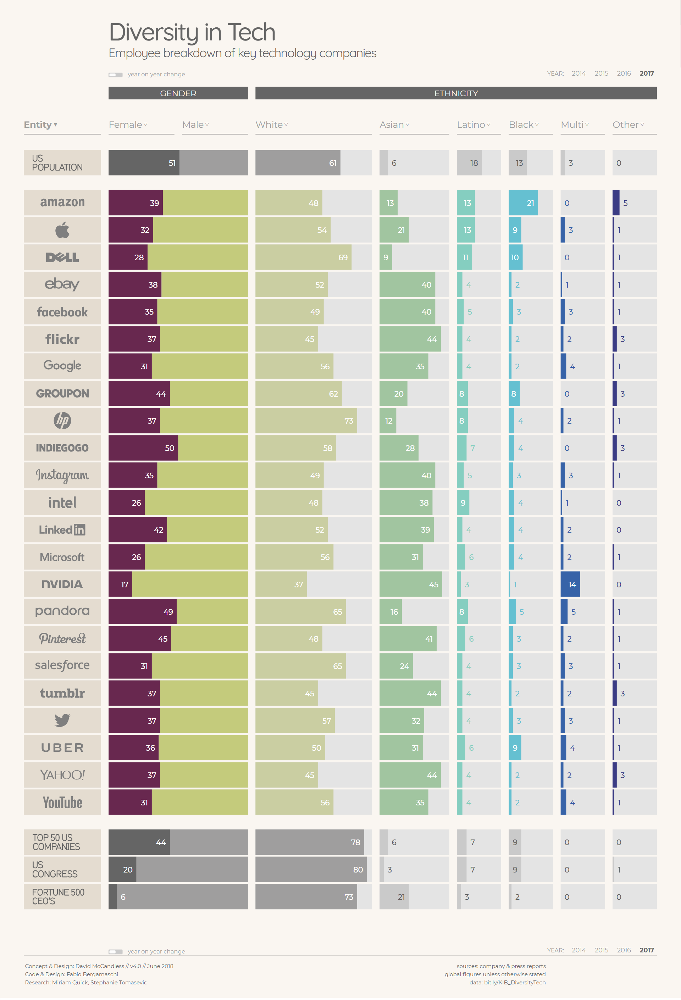

# Diversity & Inclusion in the Tech Industry

## Content

- [When Women Stopped Coding](#when-women-stopped-coding)
- [Employee breakdown of key technology companie](#employee-breakdown-of-key-technology-companies)
- [Why diversity matters to your tech company](#why-diversity-matters-to-your-tech-company)
- [Reference](#reference)

***

## When Women Stopped Coding

The ratio of women in computer science plateaued in 1984 before plummeting. The decline occurred despite continued growth in other technological and professional disciplines.

Women's participation in computer science began to decline at the same time as personal computers began to appear in American homes. These early personal computers were essentially toy computers. They were nearly solely targeted at males and boys.

The concept that computers are just for guys developed a narrative in the 1980s. It shaped geek culture and helped define who geeks were. According to a study, families are more inclined to buy laptops for boys than for girls. Jane Margolis interviewed hundreds of computer science students in the 1990s.

[Back to Content](#content)

## Employee breakdown of key technology companie

[Back to Content](#content)

## Why diversity matters to your tech company

When firm executives are committed to diversity, initiatives are more likely to succeed. Leaders must understand why diversity is important in order to make significant commitments. We spend a lot of time at Paradigm talking with CEOs and other business executives on what drives or should drive their diversity and inclusion efforts. It's beneficial to figure out why diversity and inclusion are important to you.

Diversity provides considerable benefits for teams focused on creativity and invention, according to several studies in domains such as organizational science, psychology, and education. "A completely diverse and inclusive workplace is crucial to our capacity to innovate and achieve business success," said Intel CEO Brian Krzanich.

According to studies, there is a substantial link between varied organizations and favorable financial outcomes. According to a study, having more women in senior management increases the firm's worth by $42 million. Gender representation on executive and board levels has also been linked to improved corporate success in studies. Some executives are wary to depend on the reasons listed above because some of the most successful companies have used them in the past.

Companies miss out on amazing potential by failing to attract and hire people from underrepresented backgrounds. Many IT firms take pleasure in cultivating settings in which "the greatest idea prevails." Companies have a higher chance of getting the greatest idea by recruiting diverse people and creating interviewing processes.

[Back to Content](#content)

***

## Reference

#### 1
Henn, S. (2014). When Women Stopped Coding. [online] NPR.org. Available at: https://www.npr.org/sections/money/2014/10/21/357629765/when-women-stopped-coding [Accessed 19 May 2021].

#### 2

McCandless, D. (2014). Diversity in Tech — Information is Beautiful. [online] Information is Beautiful. Available at: https://informationisbeautiful.net/visualizations/diversity-in-tech/ [Accessed 19 May 2021].

[⇐ Home Page](../../../README.md)
