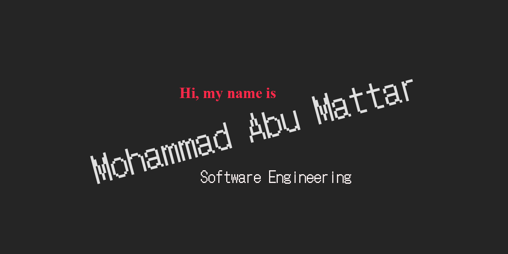

# Reading Notes

## Content
- [About me](#mohammad-abu-mattar)
    - [Connect with me](#connect-with-me)
- [Code 102 Reading Notes](#code-102-reading-notes)
- [Code 201 Reading Notes](#code-201-reading-notes)

# Mohammad Abu Mattar

Hello! 👋 I’m Mohammad Abu Mattar, a Software Engineering 👨‍💻 based in Amman, Jordan. I enjoy creating things that live on the internet, Shortly after graduating from Isra University, I joined the engineering team at Isra University as a lab-supervisor where I work on a wide variety of interesting and meaningful projects on a daily basis, but now I looking for a new journey, a new dream.

## Connect with me

[Back to Content](#content)

***

# Code 102 Reading Notes

| Content                                | Link |
| :------------------------------------: | :---------: |
| Lab 01                                  |
| Read: 01 - The Coder's Computer       | [Link](./class01/README01) |
| Lab 02                                 |
| Read: 02a - Learning Markdown         | [Link](./class02/README02A) |
| Read: 02b - Revisions and the Cloud   | [Link](./class02/README02B) |
| Lab 03                                 |
| Read: 03 - Structure web pages with HTML   | [Link](./class03/README03) |
| Lab 04                                  |
| Read: 04 - Programming with JavaScript   | [Link](./class04/READ04A) |
| Read: 04b - Computer Architecture and Logic | [Link](./class04/READ04B) |
| Lab 05                                 |
| Read: 05 - Operators and Loops | [Link](./class05/READ05) |
| Lab 06                                 |
| Read: 06b - Design web pages with CSS | [Link](./class06/READ06B) |

[Back to Content](#content)

***

# Code 201 Reading Notes

| Content                                | Link |
| :------------------------------------: | :---------: |
| Pre-Work |
| Read: 01 - Introductory HTML and JavaScript | [Link](./class07/READ07) |
| Module 1: Introduction to Web Development  |
| Module 2: The DOM, and Domain Modeling with Object Literals |
| Module 3: Libraries and Local Storage |
| Module 4: Project Work |

[Back to Content](#content)